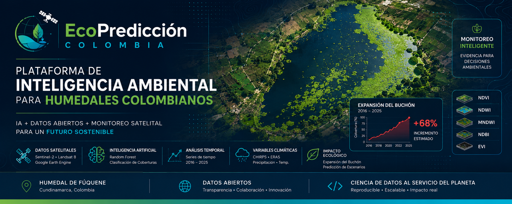

<p align="center">
   
</p>


# Sistema de Inteligencia Ambiental Predictiva para Humedales Colombianos


## Monitoreo predictivo de la Laguna de Fúquene mediante IA y datos abiertos

Plataforma de inteligencia ambiental basada en inteligencia artificial, análisis geoespacial y datos abiertos para el monitoreo, análisis y proyección ecológica de humedales colombianos.

---

# Problemática Ambiental

La Laguna de Fúquene, ubicada entre los departamentos de Cundinamarca y Boyacá, es uno de los ecosistemas acuáticos altoandinos más importantes de Colombia.

Durante las últimas décadas, este ecosistema ha sufrido una fuerte degradación ambiental causada por múltiples factores:

- expansión de vegetación invasora
- sedimentación
- contaminación hídrica
- pérdida de cobertura vegetal
- presión agropecuaria
- alteración hidrológica
- cambio climático

Uno de los principales problemas ecológicos es la proliferación del buchón de agua (*Eichhornia crassipes*), una especie invasora que puede cubrir grandes extensiones del espejo de agua, afectar la oxigenación, alterar la dinámica ecológica y poner en riesgo la biodiversidad acuática.

Diversos estudios e informes ambientales indican que la laguna ha perdido gran parte de su extensión original y presenta procesos críticos de deterioro ecológico y acumulación de nutrientes.

---

# Objetivo del Proyecto

Desarrollar una plataforma de inteligencia ambiental basada en IA y datos abiertos para detectar, monitorear y proyectar escenarios de expansión de vegetación invasora en humedales colombianos.

El proyecto busca integrar análisis satelital, modelos de machine learning y visualización interactiva para apoyar procesos de monitoreo ecológico y análisis ambiental.

---

# Componentes del Sistema

## Monitoreo satelital

Procesamiento de imágenes multitemporales usando:

- Sentinel-2
- Landsat

## Índices espectrales

- NDVI
- NDWI
- MNDWI
- FAI

## Inteligencia Artificial

Modelos de clasificación supervisada mediante:

- Random Forest
- análisis temporal
- procesamiento geoespacial

## Datos abiertos integrados

- ERA5
- CHIRPS
- IDEAM
- CAR
- Datos Abiertos Colombia

## Visualización

- dashboard interactivo
- mapas dinámicos
- análisis temporal
- visualización cloud

---

# Objetivos Estratégicos

## 1. Construir una serie histórica ambiental

Análisis temporal de cambios ecológicos entre 2016 y 2025.

## 2. Detectar expansión de vegetación invasora

Identificación de zonas críticas asociadas al buchón de agua.

## 3. Implementar modelos predictivos

Construcción de escenarios prospectivos para:

- 2030
- 2040
- 2050

## 4. Fortalecer monitoreo ambiental

Apoyar procesos de análisis territorial y toma de decisiones mediante datos abiertos e inteligencia ambiental.

---

# Arquitectura General

```text
Datos Abiertos
        ↓
Procesamiento Geoespacial
        ↓
Índices Espectrales
        ↓
Modelos IA
        ↓
Clasificación y Predicción
        ↓
Dashboard Interactivo
        ↓
Visualización y Monitoreo
```

---

# Estructura del Proyecto

```text
/assets
/dashboard
/datos
/docs
/gee
/modelos
/resultados
/validacion
```

---

# Validación

El proyecto contempla procesos de validación mediante:

- matriz de confusión
- accuracy
- precision
- recall
- F1-score
- análisis de desempeño

---

# Escalabilidad

Aunque el caso piloto corresponde a la Laguna de Fúquene, la arquitectura del sistema está diseñada para adaptarse a otros humedales y ecosistemas acuáticos colombianos.

---

# Tecnologías Utilizadas

- Google Earth Engine
- Python
- Random Forest
- Machine Learning
- Sentinel-2
- Landsat
- ERA5
- CHIRPS
- Cloud Computing
- Dashboards interactivos

---

# Estado del Proyecto

Proyecto en desarrollo.

Actualmente se trabaja en:

- consolidación de series históricas
- validación del modelo
- análisis temporal
- generación de mapas
- construcción del dashboard
- escenarios predictivos

---

# Licencia

Este proyecto se distribuye bajo licencia MIT.

---

# Referencias y contexto ambiental

La problemática ambiental de la Laguna de Fúquene ha sido documentada por entidades ambientales, investigaciones académicas y medios nacionales debido al deterioro ecológico del ecosistema y la expansión de especies invasoras como el buchón de agua.

